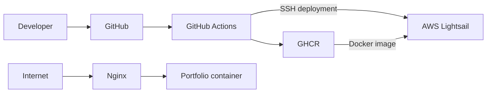

# Mingzhe Yang — Portfolio

A concise personal portfolio for showcasing my software development projects.

Live website: [yangmingzhe.com](https://yangmingzhe.com)

## Featured Project

### Sky Take-Out

A full-stack restaurant management and food ordering system built with Java, Spring Boot, Vue, MySQL, and Redis.

- [Live demo](https://skytakeout.yangmingzhe.com)
- [Source code](https://github.com/yang648557392/sky-take-out)

## Architecture



## CI/CD

Every push to the `main` branch starts the deployment pipeline:

1. GitHub Actions checks out the source code.
2. Docker builds the website image.
3. The image is published to GitHub Container Registry.
4. A deployment workflow connects to AWS using SSH.
5. AWS pulls the exact image that passed CI.
6. Docker Compose updates the running container.
7. The workflow verifies the public website.

## Technology Stack

- HTML and CSS
- Docker and Docker Compose
- Nginx
- GitHub Actions
- GitHub Container Registry
- AWS Lightsail
- Route 53
- Let's Encrypt

## Run Locally

Build the image:

```bash
docker build -t portfolio-site:local .
```

Start a container:

```bash
docker run --rm -p 127.0.0.1:8088:80 portfolio-site:local
```

Open:

```text
http://127.0.0.1:8088
```

## Repository Structure

```text
.
├── .github/workflows/   GitHub Actions workflows
├── deploy/nginx/        Production Nginx configuration
├── compose.yaml         Container runtime configuration
├── Dockerfile           Container image definition
├── index.html           Website content
└── styles.css           Website styles
```
