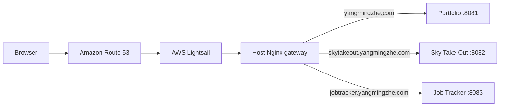
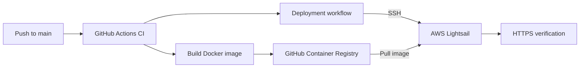

# Mingzhe Yang — Portfolio

A concise personal portfolio that introduces my software projects and documents how I deploy them.

**Live website:** [yangmingzhe.com](https://yangmingzhe.com)

## Projects

### Sky Take-Out

A full-stack restaurant management and food ordering system built with Java, Spring Boot, Vue, MySQL, and Redis.

- [Live demo](https://skytakeout.yangmingzhe.com)
- [Source code](https://github.com/yang648557392/sky-take-out)

### Job Application Tracker

A full-stack Kanban application for organizing job applications, built with Next.js, TypeScript, MongoDB, and Better Auth.

- [Live demo](https://jobtracker.yangmingzhe.com)
- [Source code](https://github.com/yang648557392/job-application-tracker)

## Architecture

The portfolio and project demos run as separate Docker containers on the same AWS Lightsail instance. A host-level Nginx gateway receives public traffic and routes each domain to the correct local container port.



## CI/CD

Every push to the `main` branch starts the automated delivery pipeline:

1. GitHub Actions checks out the source code.
2. Docker builds the website image.
3. The image is published to GitHub Container Registry (GHCR).
4. After CI succeeds, the deployment workflow connects to Lightsail through SSH.
5. Lightsail pulls the exact image that passed CI.
6. Docker Compose replaces the running portfolio container.
7. The workflow verifies the public HTTPS website.



## Technology Stack

- HTML and CSS
- Docker and Docker Compose
- Nginx
- GitHub Actions
- GitHub Container Registry
- AWS Lightsail
- Amazon Route 53
- Let's Encrypt and Certbot

## Run Locally

Build the image:

```bash
docker build -t portfolio-site:local .
```

Start a container:

```bash
docker run --rm -p 127.0.0.1:8088:80 portfolio-site:local
```

Open [http://127.0.0.1:8088](http://127.0.0.1:8088).

## Repository Structure

```text
.
├── .github/workflows/   CI and deployment workflows
├── deploy/nginx/        Host Nginx gateway configuration
├── compose.yaml         Production container configuration
├── Dockerfile           Container image definition
├── index.html           Website content
└── styles.css           Website styles
```
